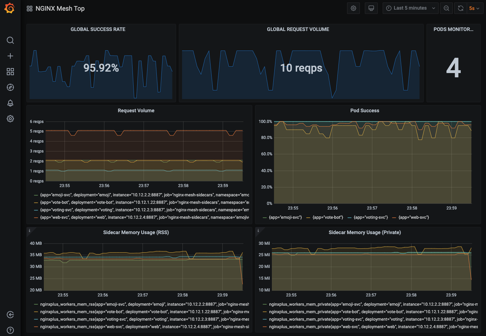

# Grafana Dashboard

The `NGINX Mesh Top` Grafana dashboard provides a high-level picture
of the request volume and success rate of all your applications in the mesh.
NGINX Service Mesh deploys Grafana and adds `NGINX Mesh Top` as the
default dashboard. If you prefer to use an existing Grafana deployment, you can import
the `NGINX Mesh Top` dashboard included in this directory. 

## Prerequisties
- Grafana version >= 5.2.0
- Prometheus datasource must be
  [configured](https://prometheus.io/docs/visualization/grafana/#creating-a-prometheus-data-source).
  
  **Note:** If you are using the Prometheus server deployed by NGINX Service Mesh you can
  find the address by running [`nginx-meshctl
  config`](https://docs.nginx.com/nginx-service-mesh/reference/nginx-meshctl/#usage).
  If you are using your own Prometheus server, make sure to add the NGINX
  Service Mesh [scrape config](../prometheus/README.md) to your
  Prometheus configuration.
 

## Installing the NGINX Mesh Top Dashboard

To install the NGINX Mesh Top Dashboard using the Grafana UI follow these steps:
- Select the New Dashboard button and click Import.
- Upload the [nginx-mesh-top.json](nginx-mesh-top.json) file or copy and paste the contents of the file in the textbox and click Load.
- Select the Prometheus data source you configured previously from the dropdown
  menu and click Import.

### Features
NGINX Mesh Top dashboard includes the following stats and graphs:

- Stats:
  - Global Success Rate: the percentage of requests that are successful over
    the last 30 seconds (`nginxplus_upstream_server_responses` with response codes of `1xx` or `2xx`).
  - Global Request Volume: the volume of requests over the last 30 seconds,
    measured in requests per second (`nginxplus_http_total_requests`) . 
  - Pods Monitored: The number of pods being scraped by Prometheus.
- Graphs:
  - Request Volume: this graph shows the volume of requests per Pod, in
    requests per second (`nginxplus_http_total_requests`).
  - Pod Success:  this graph shows the percentage of requests that are
    successful per Pod (`nginxplus_upstream_server_responses` with response codes of
    `1xx` or `2xx`).
  - Sidecar Memory Usage (RSS): this graph shows the Resident Set Size (RSS) of the NGINX sidecars.
  - Sidecar Memory Usage (Private): this graph shows the Private memory used by the NGINX sidecars.

## Customizing your own Dashboard

NGINX Service Mesh exposes NGINX Plus metrics in Prometheus format that can be used to
create your own panels and custom dashboards. For a list of available metrics, labels,
and example Prometheus queries, see the [Traffic Metrics
guide](https://docs.nginx.com/nginx-service-mesh/guides/traffic-metrics/).
